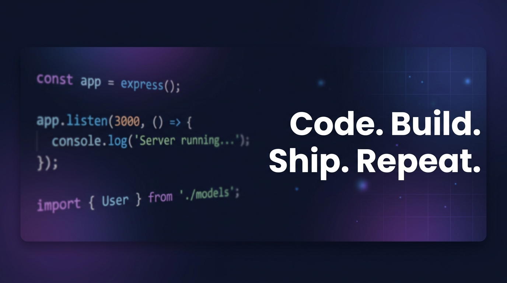

<!-- Header Banner -->

  

# Hi there, I'm Vaibhav Thakur 👋

**Full Stack Developer | Android & Game Developer | AI Enthusiast**

Passionate about building real-world products that solve real problems. I love
turning ideas into beautiful, scalable and impactful software. Currently in 5th
Semester, aiming for Software Engineer role @ **Google** / **Microsoft** / **Amazon** by **2028**.

---

<!-- Tech Stack & Goals Side by Side -->
<table width="100%">
<tr>
<td width="70%" valign="top">

## 🚀 Tech Stack

  
  
  
  
  
  
  

  
  
  
  
  
  
  

  
  
  
  
  
  
  

  
  
  
  

</td>
<td width="30%" valign="top">

## 🎯 Goals

✅ Master DS & System Design

✅ Build 10+ Real-world Projects

✅ Contribute to Open Source

🎯 Get Placed @ Google (2028)

---

### 📫 Let's connect!

</td>
</tr>
</table>

---

## 📌 Pinned Repositories

<table>
<tr>
<td width="33%" valign="top">

### 🤖 [Ira-AI-Assistant](https://github.com/madebyvaibhav/ira-ai-assistant)
Personal AI Assistant like Jarvis with voice, vision & smart automation. React Native + FastAPI + Supabase

 ⭐ 842 🍴 104

</td>
<td width="33%" valign="top">

### 🎓 [College-Management-System](https://github.com/madebyvaibhav/college-management-system)
AI powered timetable, attendance, result & exam system for smart campuses.

 ⭐ 732 🍴 96

</td>
<td width="33%" valign="top">

### 🛡️ [Cyber-Kavach](https://github.com/madebyvaibhav/cyber-kavach)
AI based cyber security tool to detect phishing, malware & fake images. Stay Safe Online!

 ⭐ 689 🍴 87

</td>
</tr>
<tr>
<td width="33%" valign="top">

### 🇮🇳 [Indian-Startup-Tycoon](https://github.com/madebyvaibhav/indian-startup-tycoon)
3D Unity Business Simulation Game – Build your own Indian Startup Empire 🚀

 ⭐ 521 🍴 74

</td>
<td width="33%" valign="top">

### 🌐 [Portfolio-Website](https://github.com/madebyvaibhav/portfolio-website)
My personal 3D portfolio website built with Next.js and Three.js

 ⭐ 418 🍴 62

</td>
<td width="33%" valign="top">

### 📚 [DSA-Sheet](https://github.com/madebyvaibhav/cpp-fundamentals)
My complete DSA journey with solutions and notes for product based companies.

 ⭐ 1.2k 🍴 264

</td>
</tr>
</table>

---

## 📊 GitHub Stats

  
  

  

---

## 🏆 GitHub Trophies

  

---

## 📈 Contribution Graph

  

---

### 🐍 Contribution Snake

<picture>
  <source media="(prefers-color-scheme: dark)" srcset="https://raw.githubusercontent.com/madebyvaibhav/madebyvaibhav/output/github-contribution-grid-snake-dark.svg" />
  <source media="(prefers-color-scheme: light)" srcset="https://raw.githubusercontent.com/madebyvaibhav/madebyvaibhav/output/github-contribution-grid-snake.svg" />
  
</picture>

---

  

**Building Scalable Web, Mobile, AI & Game Solutions | Future SDE @ Google**

*Made with 💜 by Vaibhav Thakur*

